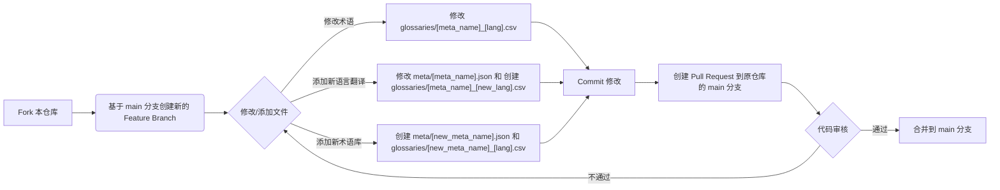

# 贡献指南

欢迎为 Immersive Translate 术语库做出贡献！我们非常感谢社区的支持。

## 贡献流程

我们使用标准的 GitHub Fork & Pull Request 工作流程。



1.  **Fork** 本仓库到你的 GitHub 账户。
2.  从 `main` 分支创建一个新的 **Feature Branch**，例如 `feature/add-tech-korean` 或 `fix/update-web3-terms`。
3.  在你的 Feature Branch 中进行修改或添加文件。
4.  **Commit** 你的修改。请撰写清晰的 Commit Message。
5.  **Push** 你的 Feature Branch 到你的 Fork 仓库。
6.  创建一个 **Pull Request**，目标是本仓库的 `main` 分支。请在 Pull Request 中详细说明你的修改内容。
7.  我们会尽快审核你的 Pull Request，并在审核通过后将其合并。

## 术语库结构

术语库主要由两部分组成：

*   `meta/` 目录：存放术语库的元数据文件（JSON 格式）。每个文件（例如 `web3.json`）定义了一个术语库，我们称文件名为 `meta_name` （例如 `web3`）。
*   `glossaries/` 目录：存放实际的术语翻译对（CSV 格式）。文件名遵循 `[meta_name]_[lang].csv` 规则，例如 `web3_zh-CN.csv` 对应 `meta/web3.json` 的简体中文术语。

## 如何添加或修改术语

### 修改现有术语

直接编辑对应的 `glossaries/[meta_name]_[lang].csv` 文件，修改 `source` 或 `target` 列的内容。

### 添加新的语言翻译

1.  打开对应的 `meta/[meta_name].json` 文件。
2.  将新的语言代码（例如 `ko`）添加到 `langs` 数组中。
3.  在 `i18ns` 对象中，为新的语言代码添加对应的 `name` 和 `description` 翻译。
4.  在 `glossaries/` 目录下，创建新的 CSV 文件，命名为 `[meta_name]_[new_lang].csv` （例如 `web3_ko.csv`）。
5.  将现有的一种语言的 CSV 文件（例如 `glossaries/web3_en.csv`）内容复制到新文件中作为模板。
6.  修改新文件，将 `target` 列翻译成新的目标语言，并将 `tgt_lng` 列的值更新为新的语言代码。

### 添加新的术语库

1.  在 `meta/` 目录下创建一个新的 JSON 文件，例如 `meta/mynewglossary.json`。`mynewglossary` 就是这个术语库的 `meta_name`。
2.  参考现有的 JSON 文件结构，填写新术语库的元数据，包括 `id`, `name`, `description`, `author`, `glossary` (应与 `id` 和 `meta_name` 保持一致), `langs` (至少包含一种语言), `i18ns` 等字段。
3.  在 `glossaries/` 目录下，为新术语库创建一个或多个 CSV 文件，例如 `glossaries/mynewglossary_en.csv`。
4.  按照 CSV 文件格式要求，在新文件中添加术语对。

## CSV 文件格式 (`glossaries/[meta_name]_[lang].csv`)

*   文件编码：UTF-8。
*   使用逗号 (`,`) 作为分隔符。
*   第一行为表头，必须包含以下三列：`source,target,tgt_lng`。
*   **`source`**: 源语言术语文本。
*   **`target`**: 目标语言术语的翻译文本。
*   **`tgt_lng`**: 该 CSV 文件对应的目标语言代码（与文件名中的 `[lang]` 部分以及 `meta.json` 中 `langs` 数组内的代码一致）。

**示例 (`glossaries/web3_zh-CN.csv`):**

```csv
source,target,tgt_lng
Blockchain,区块链,zh-CN
Cryptocurrency,加密货币,zh-CN
Token,代币,zh-CN
...
```

## Meta JSON 文件结构 (`meta/[meta_name].json`)

`meta` 目录下的 JSON 文件定义了每个术语库的属性。

**关键字段说明:**

*   `id` (string): 术语库的唯一标识符，应与文件名 (`meta_name`) 保持一致。
*   `name` (string): 术语库的英文名称（展示用）。
*   `description` (string): 术语库的英文详细描述。
*   `author` (string): 术语库的作者或来源标识。
*   `glossary` (string): 关联的基础术语库名称，应与 `id` 和文件名 (`meta_name`) 保持一致。
*   `suffix` (string, 可选): 版本或其他后缀信息。
*   `langs` (array of strings): 此术语库支持的目标语言代码列表 (例如 `["zh-CN", "zh-TW", "en"]`)。
*   `i18ns` (object): 包含各个支持语言的本地化信息。
    *   `[lang_code]` (object): 以语言代码作为键。
        *   `name` (string): 该语言下的术语库名称。
        *   `description` (string): 该语言下的术语库描述。

**示例 (`meta/web3.json`):**

```json
{
  "id": "web3",
  "name": "Web3 Expert",
  "description": "Specialized in translating Web3 and blockchain content...",
  "author": "immersive",
  "glossary": "web3",
  "suffix": "v1",
  "langs": [
    "zh-CN",
    "zh-TW"
  ],
  "i18ns": {
    "zh-CN": {
      "name": "Web3",
      "description": "专门翻译与Web3和区块链相关的内容..."
    },
    "zh-TW": {
      "name": "Web3",
      "description": "專門翻譯與Web3和區塊鏈相關的內容..."
    }
  }
}
```

## 代码风格和规范

*   CSV 文件请确保使用 UTF-8 编码。
*   Commit Message 请清晰说明修改意图。
*   Pull Request 请提供充分的说明。
